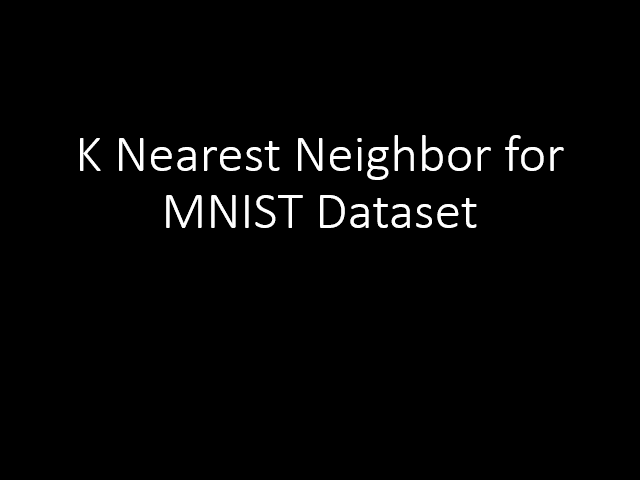

## 𝐖𝐡𝐚𝐭 𝐝𝐢𝐠𝐢𝐭 𝐢𝐬 𝐢𝐭? - 𝐄𝐱𝐩𝐥𝐨𝐫𝐢𝐧𝐠 𝐭𝐡𝐞 𝐂𝐚𝐩𝐚𝐛𝐢𝐥𝐢𝐭𝐢𝐞𝐬 𝐨𝐟 𝐊𝐍𝐍𝐬 𝐭𝐨 𝐑𝐞𝐚𝐝 𝐇𝐚𝐧𝐝𝐰𝐫𝐢𝐭𝐭𝐞𝐧 𝐃𝐢𝐠𝐢𝐭𝐬

In this new normal, the capability to transform handwritten notes to digital text is very advantageous. One use case would be for teachers. They will be able to convert their handwritten modules to digital media that they can send to their students online. Another advantage of converting notes to text is the file size. Images of the same handwritten note can have a file size that could be 1000 times bigger than the note converted that is text. This could aid a lot of people who have limited data allocation.

That is why we created a machine learning algorithm that can read handwritten digits as a proof of concept for this idea. We took the K-Nearest Neighbors’ capability to the test. We were surprised that our simple model with K=11 managed to correctly predict the handwritten digits 𝟗𝟏.𝟖% of the time!

The most misclassified digit is 8. Twenty percent ( 20% ) of the time, 8 is being misclassified mostly as 5 or 3 . On the other hand, 1 is the least misclassified, having a 0.001% chance to be mislabeled by the model.

The most misclassified pair of digits is (7,1). This means that the model would most likely misclassify the digit 7 into 1 than any other digits. This is followed by the pairs of digits (4,9) and (8,5) . The digits were seen to have geometric similarities as after converting the pixels array into images. The stroke angle and curvatures are the most striking similarities among the pairs of images.

𝐈𝐭'𝐬 𝐢𝐧𝐭𝐞𝐫𝐞𝐬𝐭𝐢𝐧𝐠 𝐭𝐨 𝐟𝐢𝐧𝐝 𝐭𝐡𝐚𝐭 𝐨𝐮𝐫 𝐦𝐨𝐝𝐞𝐥 𝐚𝐥𝐬𝐨 𝐡𝐚𝐬 𝐝𝐢𝐟𝐟𝐢𝐜𝐮𝐥𝐭𝐲 𝐰𝐢𝐭𝐡 𝐭𝐡𝐞 𝐧𝐮𝐦𝐛𝐞𝐫𝐬 𝐭𝐡𝐚𝐭 𝐰𝐞 𝐡𝐮𝐦𝐚𝐧𝐬 𝐭𝐞𝐧𝐝 𝐭𝐨 𝐦𝐢𝐬𝐜𝐥𝐚𝐬𝐬𝐢𝐟𝐲 𝐚𝐥𝐬𝐨. 😊
